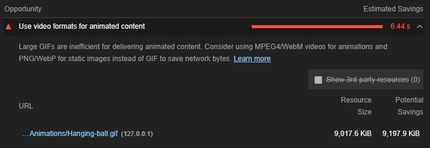
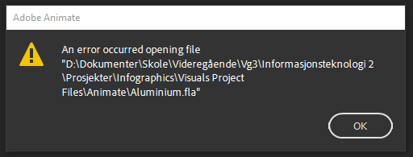
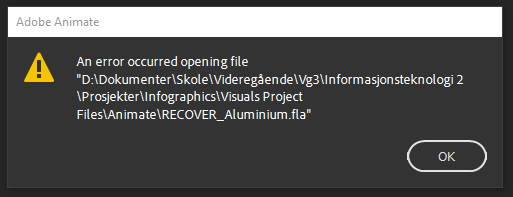

# Infographics: elektrisk potensiell energi

-------------------------------------------

## Forkunnskapar

Legg inn dette

## Val av format/oppløysing og liknande

### Hanging ball

Det var mykje styr med denne fila. Fyrst av alt, hadde eg tenkt å bruke Animate sin web-integrasjon, men det vart rot når eg hadde fleire animasjonar på same side. Dette er kommentert der det er relevant. Vidare valde eg å eksportere som gif som alternativ 2. Når eg køyrde [Lighthouse](https://developers.google.com/web/tools/lighthouse) på nettsida, fekk eg kjeft for dette:

Eg følgde linken, og brukte ffmpeg for å konvertere til webm. Diverre kjem det fram kompresjonsartefaktar no, men det er ikkje så merkeleg. Animate kan ikkje eksportere til webm, og med så mange stopp, er videoen dømt til å møte konsekvensar i kvalitet. Det viktige er at videoen framleis viser ballen tydeleg og at vi slepp unna gamle standardar.

## Verd å merke

### Ladningane i Coulombs lov

I visninga av Coulombs lov har eg kopiert SVG-kode. Dette fordi eit vanleg ``-element ikkje strekk til for det som var naudsynt i dette tilfellet. Med éin gong ein SVG vert pakka i eit ``-element, mister ein dei individuelle elementa. For å gjere det interaktivt, måtte eg kunne kople dei via JavaScript, og eg fann ingen god måte å importere dei som fil (`<svg src="...">` fungerte ikkje.).

Vidare er ikkje løysinga heilt ferdig, som vi kan sjå på partikla sjølve når ein byttar om. Gratientane som vert refererte får ikkje endra posisjonen mellom dei to ladningane. Dette resulterer i at når ladninga som startar som elektron byttar til proton, verkar det som at fargen er uniform. I røynda er det berre at sentrum i gradienten framleis ligg i sentrum til protonet. Teksten gjer òg noko merkeleg hopping, og det vert ikkje prioritert.

### Korrupt .fla-fil

Eg hadde planar om å leggje til ein animert bakgrunn til `<header>`, slik som [her](https://tympanus.net/Development/AnimatedHeaderBackgrounds/index3.html). Planen var eit animert aluminium-atom, kor elektrona gjekk i roleg bane om kjerna. Dette gjekk strålande, fram til Animate kræsja, og gjorde fila korrupt (Dette skjedde òg med RECOVERY-fila). Under `Visuals Project Files > Animate > Aluminium.fla` ligg fila, uferdig sådan.

**Dette var beskjeden Animate kom med etter kræsj:**
 

### `assets > Animations > Work r - R`

Desse filene er kjelder til koden som er inkludert i `index.html` og `index.js` for å animere heliumatomet. `Work r - R.js` vert importert, og eg har kopiert relevant kode frå `Work r - R.html`.

## Skjematiske krav

Nedbrutte kompetansemål| Låg | Middels | Høg
-----------------------|-----|---------|----
 Begrunnelsar          |     |         | Forklarar kort kva produktet er, kva det inneheld og i kva form det skal bli brukt. Dette inkluderer å spesifisere ei målgruppe og kva konsekvensar dette har. Begrunner og drøftar tydeleg og konkret val av: størrelse, oppløysning format. _Plasser dette i eit eige dokument du legg ved._

## Kjelder

- [Mathjax](https://www.mathjax.org/)
- [Wikipedia-Coloumbkonstanten](https://en.wikipedia.org/wiki/Coulomb_constant)
- Callin, P., Pålsgård, J., Stadsnes, R., & Tellefsen, C. W. (2012). ERGO - Fysikk 2. H. Aschehoug & Co.
- Andre kjelder er refererte i koden der det er relevant
