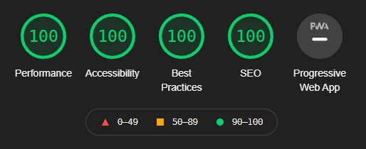

# Infographics: elektrisk potensiell energi

-------------------------------------------

## Om infografikken og forkunnskapar

Infografikken er meint til å bli nytta med ein nettlesar på PC. Han er ikkje laga responsiv, og er stort sett testa på 1440p.

Bodskapen i infografikken er avgrensa til prov for elektrisk potensiell energi, men inkluderer døme for å gjere dette lettare å forstå. Det vert ikkje forklart kva ein kan bruke dette til, eller gjeve matematiske døme. Han vil fungere betre som fordjuping i akkurat dette emnet. Målgruppa er dei som lærer dette for fyrste gong, eller dei som søkjer etter å forstå fenomenet betre.

Det er nemleg venta at lesaren skal ha noko kunnskap om fysikk før han byrjar på denne infografikken. Det vil nok vere vanskeleg å forstå om ein ikkje har vore gjennom fysikk 1 og delar av fysikk 2. Ein må kunne den matematiske samanhengen mellom krefter og arbeid for ikkje-konstante krefter. I tillegg bør han ha kunnskap om oppbyggjinga til atom, og det hjelp godt å vite korleis ladde partiklar tiltrekkjer/støyter frå andre partiklar.

## Val av format/oppløysing og liknande

### Hanging ball

Det var mykje styr med denne fila. Fyrst av alt, hadde eg tenkt å bruke Animate sin web-integrasjon, men det vart rot når eg hadde fleire animasjonar på same side. Dette er kommentert der det er relevant. Vidare valde eg å eksportere som gif som alternativ 2. Når eg køyrde [Lighthouse](https://developers.google.com/web/tools/lighthouse) på nettsida, fekk eg kjeft for dette:

Eg følgde [lenka](https://web.dev/efficient-animated-content/?utm_source=lighthouse&utm_medium=devtools), og brukte ffmpeg for å konvertere til webm. Diverre kjem det fram kompresjonsartefaktar no, men det er ikkje så merkeleg. Animate kan ikkje eksportere til webm, og med så mange stopp, er videoen dømt til å møte konsekvensar i kvalitet. Det viktige er at videoen framleis viser ballen tydeleg og at vi slepp unna gamle standardar. Det skal seiast at .webm-fila er 40 kB mot 4,5 MB på .gif-fila.

### Work r - R

Dette var animasjonen som kom direkte frå Animate sin web-integrasjon. Eg tenkte det ville vere den beste løysinga; eg hadde animert alt mtp. at det skulle vere skalerbart. Det vert rendra som eit `<canvas>`-element, men i den oppløysinga som vert oppgitt. Det er greitt, for då får vi framleis biletet i eit fleksibelt format (om ein skulle endre oppløysing). Per no er det 600×600, som skal vere nok for dei fleste normale skjermoppløysingar.

### Statisk svg

Alle statiske grafiske ressursar eg brukte, bygde eg i svg. Dette fordi det formatet er fantastisk å kunne skalere opp og ned utan konsekvensar i kvalitet eller filstorleik. Desse vart laga i Illustrator og vidare importert til Animate. Her fungerer det godt mellom Adobe-programma, og ein får utnytta svg til sitt ytste. På nettsida har eg eit noko knotete system med `<svg>`. Dette er skildra under [Ladningane i Coulombs lov](./README.md#ladningane-i-coulombs-lov)

### Lighthouse

Sidan ytelse er ein del av denne oppgåva, brukte eg Lighthouse til å sjekke det. Primært media, som vist over. Etter å ha eliminiert gif og lagt inn noko meta, var Lighthouse nøgd

## Verd å merke

### Ladningane i Coulombs lov

I visninga av Coulombs lov har eg kopiert SVG-kode. Dette fordi eit vanleg ``-element ikkje strekk til for det som var naudsynt i dette tilfellet. Med éin gong ein SVG vert pakka i eit ``-element, mister ein dei individuelle elementa. For å gjere det interaktivt, måtte eg kunne kople dei via JavaScript, og eg fann ingen god måte å importere dei som fil (`<svg src="...">` fungerte ikkje.).

Vidare er ikkje løysinga heilt ferdig, som vi kan sjå på partikla sjølve når ein byttar om. Gratientane som vert refererte får ikkje endra posisjonen mellom dei to ladningane. Dette resulterer i at når ladninga som startar som elektron byttar til proton, verkar det som at fargen er uniform. I røynda er det berre at sentrum i gradienten framleis ligg i sentrum til protonet. Teksten gjer òg noko merkeleg hopping, og det vert ikkje prioritert.

### Korrupt .fla-fil

Eg hadde planar om å leggje til ein animert bakgrunn til `<header>`, slik som [her](https://tympanus.net/Development/AnimatedHeaderBackgrounds/index3.html). Planen var eit animert aluminium-atom, kor elektrona gjekk i roleg bane om kjerna. Dette gjekk strålande, fram til Animate kræsja, og gjorde fila korrupt (Dette skjedde òg med RECOVERY-fila). Under `Visuals Project Files > Animate > Aluminium.fla` ligg fila, uferdig sådan.

**Dette var beskjeden Animate kom med etter kræsj:**

 

### `assets > Animations > Work r - R`

Desse filene er kjelder til koden som er inkludert i `index.html` og `index.js` for å animere heliumatomet. `Work r - R.js` vert importert, og eg har kopiert relevant kode frå `Work r - R.html`.

## Kjelder

- [Mathjax](https://www.mathjax.org/)
- [Wikipedia-Coloumbkonstanten](https://en.wikipedia.org/wiki/Coulomb_constant)
- Callin, P., Pålsgård, J., Stadsnes, R., & Tellefsen, C. W. (2012). ERGO - Fysikk 2. H. Aschehoug & Co.
- Andre kjelder er refererte i koden der det er relevant
